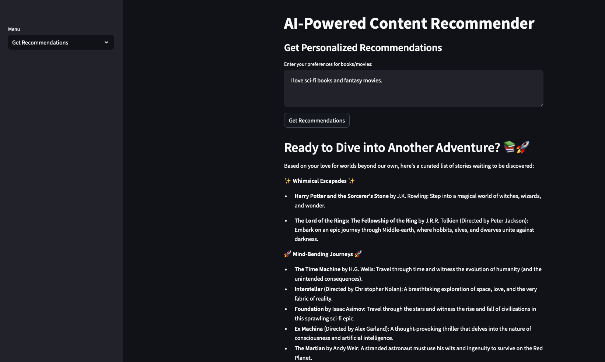
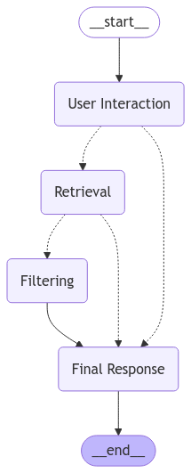

# AI-Powered Content Recommender

This project is an AI-powered content recommender system that provides personalized recommendations for books and movies based on user preferences. It utilizes FastAPI for the backend, Supabase as the database, LangChain and LangGraph for AI-based workflow management, and Streamlit for the frontend UI.


| Recommendation example |  State graph |
|------------|-------------|
|  |  |


## Features

- User Authentication: Register and log in securely.

- Token-Based Authentication: Ensures secure API calls using JWT tokens.

- Content Recommendation: Uses AI models to provide personalized recommendations.

- Workflow Visualization: Displays the recommendation workflow as a graph.

- Interactive UI: Streamlit-based interface for easy interaction.

## Tech Stack

- Backend: FastAPI, Supabase, LangChain, LangGraph, JWT

- Frontend: Streamlit

- Database: Supabase

- LLM: ChatGroq (Groq API)

## Setup Instructions

Prerequisites

Ensure you have the following installed:

- Python 3.8+

- pip

- virtualenv (optional but recommended)

- Supabase account

- Groq API key

1. **Clone the Repository**

```bash
git clone https://github.com/gokul-gopan-k/AI_agent_powered_Recommender_System.git
cd AI_agent_powered_Recommender_System
```

2. **Create a Virtual Environment (Optional but Recommended)**

```bash
python -m venv venv
source venv/bin/activate  # On Windows use `venv\Scripts\activate`
```

3. **Install Dependencies**

```bash
pip install -r requirements.txt
```

4. **Set Up Environment Variables**

Create a .env file in the root directory and add the following:

```bash
SUPABASE_URL=<your_supabase_url>
SUPABASE_KEY=<your_supabase_key>
GROQ_API_KEY=<your_groq_api_key>
BACKEND_URL=http://localhost:8000
```

## Running the Application

Start the FastAPI Backend

```bash
uvicorn main:app --host 0.0.0.0 --port 8000 --reload
```

Start the Streamlit Frontend

```bash
streamlit run streamlit_app.py
```

## Usage

1. **Register a New User**

Navigate to the Register section in the Streamlit UI.

Enter your email and password to create an account.

2. **Log In**

Navigate to the Login section.

Enter your registered credentials to obtain an authentication token.

3. **Get Recommendations**

Enter your preferences (e.g., "I like sci-fi movies and fantasy books").

Click on Get Recommendations to receive personalized suggestions.

4. **View AI Agent States**

Enter your preferences and click Get Agent States to see how the AI processes your request.


## API Endpoints

| Method | Endpoint | Description |
|----------|----------|----------|
| GET  | /  | Health check for the API  |
| POST   | /register   | Register a new user   |
| POST  | /login  | Authenticate user and return token  |
| POST  | /recommend  | Get AI-generated recommendations  |
| POST  | /get_state  | Fetch AI agent states |
| GET | /visualize_workflow | Generate and view workflow visualization |


## Troubleshooting

- Database Connection Issues: Ensure your Supabase credentials are correct.

- Invalid API Key Errors: Verify the Groq API key in the .env file.

- Authentication Errors: Ensure you are logged in and passing the token in the request headers.

## Future Enhancements

- Add support for additional content types (e.g., music, podcasts).

- Improve filtering logic using vector embeddings.

- Implement user feedback for better recommendations.
